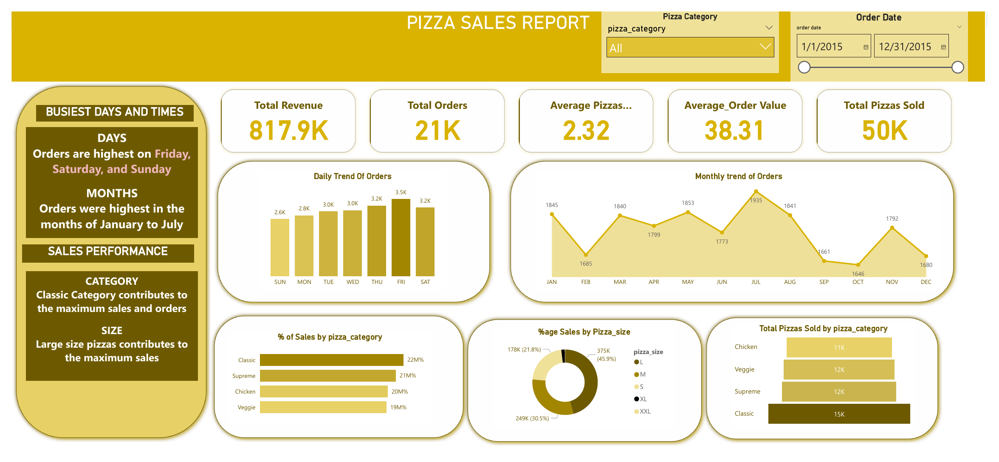

# Pizza Sales Analysis with SQL and Power BI

**I analysed a year of pizza orders (2015) with SQL Server and built a Power BI dashboard: $817.9K revenue from 21K orders and 50K pizzas, with large pizzas making up 45.9% of sales.**

SQL Server (T-SQL) · Power BI Desktop · Excel | May 2025


## Contents

1. [Overview](#overview)
2. [Data](#data)
3. [Tools](#tools)
4. [Data preparation](#data-preparation)
5. [Analysis](#analysis)
6. [Results](#results)
7. [Recommendations](#recommendations)
8. [Limitations](#limitations)
9. [How to open the files](#how-to-open-the-files)
10. [References](#references)

## Overview

I wanted to find the best and worst selling pizzas, the busiest days and months, and how revenue splits across pizza categories and sizes. The results are in a two page Power BI dashboard that a restaurant manager could use to plan stock, staffing and promotions.

## Data

- **Table:** `pizza_sales`, one row per pizza line in an order
- **Period:** January to December 2015
- **Key columns:** `order_id`, `order_date`, `pizza_name`, `pizza_size`, `pizza_category`, `quantity`, `total_price`
- The raw CSV is not included in this repository.

## Tools

- **SQL Server (T-SQL)** for the KPI and trend queries in [queries.sql](queries.sql)
- **Power BI Desktop** for the dashboard ([Pizza sales.pbix](Pizza%20sales.pbix), PDF export in [Pizza sales.pdf](Pizza%20sales.pdf))
- **Excel** for checking the CSV structure and formats

## Data preparation

- Removed duplicate rows and made sure data types were consistent (dates, numeric totals)
- Standardised pizza category and size names
- Checked for null or invalid entries, such as missing prices or sizes
- Added month and day name fields for trend analysis

## Analysis

All queries are in [queries.sql](queries.sql). They cover:

- **KPIs:** total revenue, total orders, total pizzas sold, average order value and average pizzas per order
- **Trends:** orders by day of the week and by month
- **Mix:** percentage of sales by pizza category and by pizza size, and pizzas sold by category
- **Best and worst sellers:** top 5 and bottom 5 pizzas by revenue, quantity and number of orders

Example, total revenue:

```sql
SELECT SUM(total_price) AS Total_Revenue
FROM pizza_sales;
```

## Results

| KPI | Value |
|---|---|
| Total revenue | $817.9K |
| Total orders | 21K |
| Total pizzas sold | 50K |
| Average order value | $38.31 |
| Average pizzas per order | 2.32 |

- **Days:** Friday had the most orders (3.5K), followed by Thursday and Saturday (3.2K each). Sunday had the fewest (2.6K).
- **Months:** July (1,935 orders) and January (1,845) were the busiest months. September and October were the quietest (1,661 and 1,646).
- **Category:** Classic pizzas brought in the most sales and orders (15K pizzas sold). Supreme, Veggie and Chicken followed closely.
- **Size:** Large pizzas made up 45.9% of sales, medium 30.5% and small 21.8%. XL and XXL sizes were rare.



## Recommendations

- Keep large pizzas well stocked and promoted, since they bring in the most sales.
- Plan more staff for Thursday to Saturday, when orders peak.
- Review the bottom 5 pizzas by revenue and orders and consider dropping or reworking them.
- Use combo deals to raise the average order value above $38.
- Use the quieter months (September and October) for promotions.

## Limitations

- Only one year of data (2015), so I cannot look at long term trends.
- No customer level data, so repeat buyers and customer segments cannot be analysed.
- External factors such as weather, holidays and marketing campaigns are not in the data.
- No data on toppings or customisation.

## How to open the files

- **Dashboard:** open `Pizza sales.pbix` in [Power BI Desktop](https://powerbi.microsoft.com/desktop/) (free, Windows). If you do not have Power BI, open `Pizza sales.pdf`.
- **Queries:** run `queries.sql` in SQL Server Management Studio or Azure Data Studio against a `pizza_sales` table loaded from the CSV.

## References

- [Power BI documentation](https://learn.microsoft.com/en-us/power-bi/)
- [SQL Server T-SQL reference](https://learn.microsoft.com/en-us/sql/t-sql/language-reference)

## Contact

Kaweesi Abdulrahim Mukisa · mukisakaweesi@gmail.com · [LinkedIn](https://www.linkedin.com/in/kaweesi-abdulrahim-mukisa-919326252/) · [Portfolio](https://app.notion.com/p/1fcc3e1ef98f80e4bd57c2148954d746)
